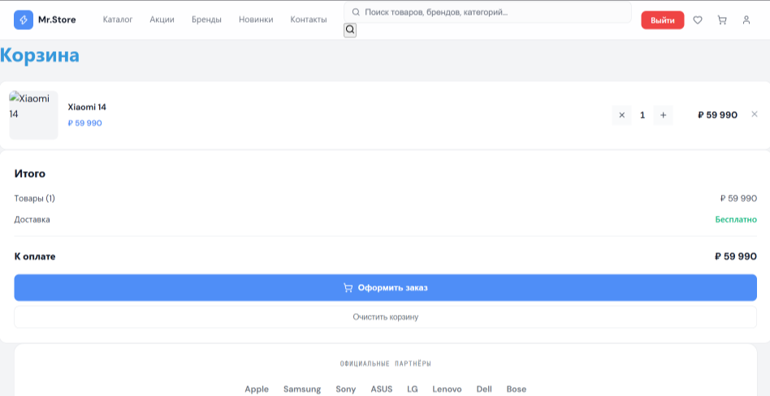
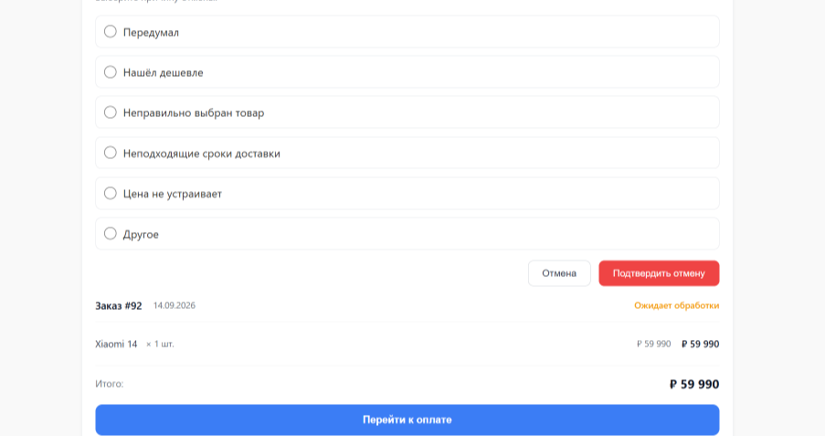
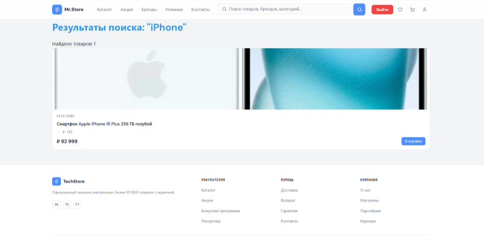

# MAGIC - Интернет-магазин

FastAPI + React интернет-магазин с системой аутентификации, каталогом товаров, отзывами и корзинами.

## 🚀 Технологический стек

**Backend:**
- FastAPI (Python 3.12+)
- PostgreSQL + asyncpg
- SQLAlchemy 2.0 (async)
- JWT-аутентификация
- Alembic (миграции)

**Frontend:**
- React

## 📸 Скриншоты проекта

### Главная страница


### Корзина


### Отмена заказа


### Поиск товаров


## 📋 Основные функции
- Регистрация и авторизация (JWT tokens)
- Управление товарами (CRUD для продавцов)
- Каталог товаров с фильтрами и поиском
- Корзина покупок
- Иерархические категории
- Защита от брутфорса (5 попыток / 5 мин)
- Content Security Policy (CSP)
- CORS конфигурация
- Отмена заказа
- Личный профиль
## 🔐 Роли пользователей

| Роль | Права |
|------|-------|
| **buyer** | Регистрация, просмотр товаров, отзывы, корзина |
| **seller** | Создание/редактирование/удаление своих товаров |
| **admin** | Полный доступ (удаление отзывов, просмотр профилей) |

## 🛠 Установка

### Backend

```bash
# Установить зависимости
pip install -r requirements.txt

# Настроить переменные окружения
# app/config.py или .env файл

# Применить миграции
alembic upgrade head

# Запустить сервер
uvicorn app.main:app --reload --host 0.0.0.0 --port 8000
```

### Frontend

```bash
cd frontend
npm install
npm start
```

## 📂 Структура проекта

```
FASTAPI/
├── app/
│   ├── routers/        # API endpoints
│   ├── models/         # SQLAlchemy модели
│   ├── schemas/        # Pydantic схемы
│   ├── auth.py         # JWT и хеширование
│   ├── database.py     # Подключение к БД
│   └── main.py         # FastAPI приложение
├── frontend/           # React приложение
├── requirements.txt
└── seed_db.py
```

## 🔑 API endpoints

| Метод | Endpoint | Доступ |
|-------|----------|--------|
| POST | `/users/token` | Публично |
| POST | `/users/` | Публично (регистрация) |
| GET | `/users/me` | Авторизованный пользователь |
| GET | `/products/` | Публично |
| POST | `/products/` | seller/admin |
| PUT | `/products/{id}` | seller/admin (свои товары) |
| GET | `/categories/` | Публично |
| POST | `/categories/` | seller/admin |
| GET | `/reviews/` | Публично |
| POST | `/reviews/` | buyer |

## 🧪 Тестирование

```bash

```

## 🔒 Безопасность

- **CORS**: разрешены только `localhost:3000`
- **CSP**: `default-src 'self'`, `script-src 'self'`
- **Брутфорс-атаки**: 5 попыток → блокировка на 5 минут (429)
- **IDOR**: проверка `seller_id` при изменении товаров
